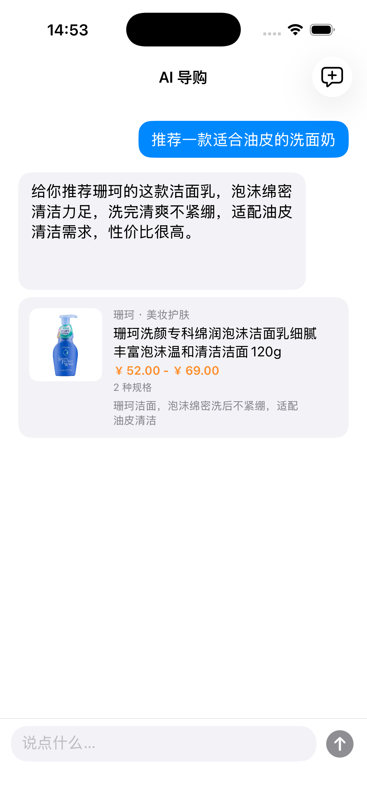

# 基于 RAG 的多模态电商智能导购 AI Agent

> 把传统“展示型电商广告”升级为“交互型 AI 导购”：iOS 原生 App + FastAPI 后端 +
> Doubao LLM + Milvus Lite 向量检索，端到端跑通文本 / 图片 / 语音多轮对话推荐。

完整设计请阅读 [`docs/01_项目开发文档.md`](docs/01_项目开发文档.md)；数据 / 后端 / iOS 三向细节分别在 `docs/02`、`docs/03`、`docs/04`。

---

## 仓库结构

```
.
├── docs/                       # 全部 Markdown 文档
├── server/                     # 后端（FastAPI + Python 3.11）
├── client/                     # iOS 客户端（Swift / SwiftUI）
├── docker/                     # 本地基础设施（MySQL 8）
└── ecommerce_agent_dataset/    # 课题给定的 100 条脱敏商品数据
```

---

## 一键启动（开发期 demo）

> 前置：macOS 已安装 Docker Desktop、Python 3.11、Xcode 15+。

### 1. 起本地 MySQL 8

```bash
cd docker/mysql
docker compose up -d
docker exec shopping_mysql mysqladmin ping -h 127.0.0.1 -u root -proot_pwd
```

### 2. 后端环境 + 建表

```bash
cd ./server
python3.11 -m venv .venv && source .venv/bin/activate
pip install -r requirements.txt
cp .env.example .env                              
python -m app.db.init_db                          
uvicorn app.main:app --reload --host 0.0.0.0 --port 8000
```

健康检查：

```bash
curl http://127.0.0.1:8000/healthz
# {"app":"ok","db":"ok","db_error":null}
```

### 3. iOS 客户端

```bash
cd ./client
# 用 Xcode 打开 ShoppingGuide.xcodeproj（Phase 0 暂未生成 Xcode 工程文件，
# 请按 client/README.md 在本机新建 SwiftUI 工程后把 ShoppingGuide/ 下源码加入）。
```

---

## 阶段进度

- [x] **Phase 0**：环境与脚手架
- [x] **Phase 1**：数据工程与向量索引 ([详情](#phase-1-数据工程与向量索引)，[评测报告](docs/phase1_eval_report.md))
- [x] **Phase 2**：后端最小闭环 ([详情](#phase-2-后端最小闭环))
- [x] **Phase 3**：iOS 客户端最小闭环 ([详情](#phase-3-ios-客户端最小闭环))
- [ ] Phase 4：对话能力增强（多轮 / 反选 / 对比）
- [ ] Phase 5：加分项（业务闭环 / 多模态 / 性能）
- [ ] Phase 6：打磨与交付

---

## Phase 1 数据工程与向量索引

100 件商品 → 1092 条文本 chunk → 2048 维向量索引 → 25 条评测 query **Top-5 召回 100%**。

按设计文档 [`docs/02_数据工程与RAG设计.md`](docs/02_数据工程与RAG设计.md) 落地，三步走：

### (a) Chunker + MySQL 主表灌库

| 文件 | 实现 |
| --- | --- |
| [`server/app/rag/chunker.py`](server/app/rag/chunker.py) | 单商品 JSON → 按 `title / description / faq / review` 四种语义字段切 chunk（不做固定 token 切分，避免 FAQ 被切碎）；每条 chunk 带 `product_id / chunk_type / category / brand / base_price / min_sku_price / max_sku_price / rating / source_id` metadata，价格字段强制 float 便于后续 Milvus 范围过滤 |
| [`server/tests/test_chunker.py`](server/tests/test_chunker.py) | 10 个单测：chunk 类型完整 / 计数与原 JSON 对齐 / source_id 唯一 / review rating 透传 / 全数据集产出落在 [800, 1200] 区间 / 空 rag_knowledge 兜底 |
| [`server/scripts/seed_mysql.py`](server/scripts/seed_mysql.py) | 遍历 `ecommerce_agent_dataset/*/data/*.json`，按 `product_id` 主键 upsert 写入 `products` + `skus` 表；幂等（重复跑数量不变），支持 `--truncate` 强制重灌、`--dataset` 自定义路径 |

**产出实测：**

```
chunker：100 件商品 → 1092 条 chunk
  └─ title=100  description=100  faq=439  review=453
seed_mysql：products=100，skus=585，按品类均分 (美妆/数码/服饰/食品 × 25 件)
chunker 单测：10/10 全过
```

### (b) Embedder + Milvus Lite 向量索引

| 文件 | 实现 |
| --- | --- |
| [`server/app/rag/embedder.py`](server/app/rag/embedder.py) | Doubao Embedding 封装：走 `client.multimodal_embeddings.create()`（控制台已下线纯文本 Embedding，统一改用多模态模型，文本走 `{"type":"text","text":...}` 单输入返回单向量）；ThreadPoolExecutor 8 路并发凑吞吐；tenacity 指数退避重试 429 / 5xx / 超时；写入前强制 L2 归一化；首调用懒探测 dim |
| [`server/app/rag/milvus_store.py`](server/app/rag/milvus_store.py) | `products_text` collection 封装：13 字段 schema（含 metadata 全量）、FLAT 索引 + IP metric（1000 条规模 FLAT 暴搜即可，省去 IVF 训练）；`ensure_collection(rebuild=False)` 幂等建库、`insert_chunks / search / count` 三个最小操作面 |
| [`server/scripts/build_index.py`](server/scripts/build_index.py) | 串起 chunker + embedder + milvus_store 的端到端入口：支持 `--rebuild` 重建、`--limit N` 联调用前 N 件、`--dry-run` 只跑 chunker 不调 API；跑完自动做一次 sanity Top-3 抽查 |
| [`server/app/config.py`](server/app/config.py) | 新增 `ARK_EMBEDDING_API_KEY`（可选，缺省回退到 `ARK_API_KEY`），用于 LLM 与 Embedding 分账户的场景（主办方 key 调不了你自己账号下的 Embedding 端点） |

**产出实测（1092 条全量）：**

```
Embedding：17.4s （8 路并发）
写入 Milvus：1092 条，dim=2048
Sanity search Top-3（用 p_beauty_001 自身向量当 query）:
  1.0000  p_beauty_001  title
  0.8877  p_beauty_001  description
  0.7261  p_beauty_002  title    (兰蔻精华，同类目相邻品牌)
```

**期间踩到的依赖坑（已在 `requirements.txt` 修改配套版本）：**

1. `pymilvus 2.4.9` 依赖 `pkg_resources`（setuptools 81 起被移除）→ 升 `pymilvus==2.5.18`
2. `milvus-lite 3.0` 的 search 服务端 bug（`AttributeError: function_score`）→ 降回 `milvus-lite==2.5.1`
3. 而 `milvus-lite 2.5.1` 又依赖 `pkg_resources` → 钉 `setuptools<81`（临时方案，milvus-lite 迁移 importlib.metadata 后可摘）
4. 控制台已下线纯文本 Embedding 模型，只剩 `doubao-embedding-vision-*` 多模态系列 → Embedder 改用 `multimodal_embeddings.create()` 接口

### (c) Top-K Recall 评测

| 文件 | 实现                                                                                                                           |
| --- |------------------------------------------------------------------------------------------------------------------------------|
| [`server/scripts/eval/queries.json`](server/scripts/eval/queries.json) | 25 条手工黄金集，覆盖四种意图：`category_recommend` × 8 / `price_filter` × 5 / `brand_exclude` × 4 / `scenario` × 8；每条标 1-3 个示例 product_id |
| [`server/scripts/eval_recall.py`](server/scripts/eval_recall.py) | 黄金集逐条 embed → search Top-50 chunk → 按 product_id 去重 → 计算 Top-1/3/5/10 Recall；按意图分组统计；可选 `--output` 输出 Markdown 报告            |

**评测结果：**

| 指标 | Top-1 | Top-3 | Top-5 | Top-10 |
| --- | --- | --- | --- | --- |
| **总体 Recall** | **80.00%** (20/25) | **100%** (25/25) | **100%** (25/25) | **100%** (25/25) |

| 意图 | n | Top-1 | Top-3 | Top-5 |
| --- | --- | --- | --- | --- |
| category_recommend | 8 | 87.5% | 100% | 100% |
| price_filter | 5 | 100% | 100% | 100% |
| scenario | 8 | 100% | 100% | 100% |
| brand_exclude | 4 | **0%** | 100% | 100% |

- **Top-5 100% 达 [docs/02 §9.2](docs/02_数据工程与RAG设计.md#92-指标) 目标（≥ 80%）**
- `brand_exclude` Top-1=0% 印证了 docs/02 §5.4 的设计预判——"向量模型不擅长否定语义"，这块要靠 Phase 2 的 Query Rewriter 把"非 X 品牌"解析成 metadata 过滤，不是 Phase 1 向量召回能解决的
- 全量耗时 3.5s（25 次 embed + 25 次 search）

完整 query-级别明细见 [`docs/phase1_eval_report.md`](docs/phase1_eval_report.md)。

### Phase 1 复跑指令

```bash
cd server
source .venv/bin/activate

# 1. (a) MySQL 主表
python -m app.db.init_db        # 建表（已存在跳过）
python -m scripts.seed_mysql    # 灌 100 件商品

# 2. (b) 向量索引
python -m scripts.build_index --rebuild   # 全量 ~20s

# 3. (c) 评测
python -m scripts.eval_recall --output ../docs/phase1_eval_report.md
```

---

## Phase 2 后端最小闭环

FastAPI + SSE + Agent 编排，把 Phase 1 的向量索引串成可被 iOS 调用的实时对话接口。完整流程：

```
iOS  ── POST /api/v1/chat/stream ──▶  IntentRouter
                                       └─▶ RagRetriever (embed → Milvus → 聚合 Top-N)
                                              └─▶ PromptBuilder (RECOMMEND / COMPARE)
                                                     └─▶ Doubao LLM stream
                                                            └─▶ ProductCardExtractor
                                                                   └─▶ MySQL hydrate
                                                                          └─▶ SSE events
```

### (a) Agent 层

| 文件 | 实现 |
| --- | --- |
| [`server/app/agent/intent.py`](server/app/agent/intent.py) | 规则版 IntentRouter：关键词区分 recommend / compare / cart_op / clarify_needed，省一次 LLM 调用降低首 token 延迟；Phase 4 再 fallback LLM JSON 抽取 |
| [`server/app/agent/prompts.py`](server/app/agent/prompts.py) | 集中管理 RECOMMEND / COMPARE 两套 Prompt；硬约束 `product_id` 仅从 `<retrieved_products>` 取、找不到必须明说"抱歉未找到"、卡片协议用 ```product_cards 围栏 JSON 输出 |
| [`server/app/agent/card_extractor.py`](server/app/agent/card_extractor.py) | 流式 token 解析器：识别 ```product_cards 围栏、跨 token 切分容错、JSON 解析、`allowed_ids` 过滤幻觉 product_id、reason 字段 ≤120 字符截断；围栏未闭合时整段丢弃绝不当正文吐 |
| [`server/app/agent/memory.py`](server/app/agent/memory.py) | 进程内会话记忆：session_id 缺失生成 UUID，最近 6 轮 FIFO 截断，记录 `last_recommended_ids` 给 Phase 4 指代消解用 |
| [`server/app/agent/orchestrator.py`](server/app/agent/orchestrator.py) | 主流程编排：emit session → 意图分发 → 检索 → Prompt → LLM 流式 → 卡片提取 → MySQL hydrate → emit done；LLM 异常降级到推 Top-3 检索结果作为兜底卡片 |

### (b) LLM / 检索封装

| 文件 | 实现 |
| --- | --- |
| [`server/app/llm/doubao_client.py`](server/app/llm/doubao_client.py) | `AsyncArk.chat.completions.create(stream=True)` 封装：`chat_stream(messages) → AsyncIterator[str]`，跳过空 delta / 心跳 chunk |
| [`server/app/rag/retriever.py`](server/app/rag/retriever.py) | Phase 1 embedder + milvus_store 之上的聚合层：query → Top-K chunk → 按 product_id 去重保留最高分 → 返回 `RetrievedProduct` 列表 |
| [`server/app/db/product_repo.py`](server/app/db/product_repo.py) | SSE 卡片 hydrate 用：`get_card_view(product_id)` 查 MySQL Products+SKUs，拼出标题 / 品牌 / image_url / price_range / SKU 列表；LLM 不允许参与任何字段填充 |

### (c) API 层

| 文件 | 实现 |
| --- | --- |
| [`server/app/api/chat.py`](server/app/api/chat.py) | `POST /api/v1/chat/stream`：sse-starlette EventSourceResponse + ping=15s 心跳；按 docs/03 §3.2 契约 emit session / status / token / product_card / clarify / error / done 七类事件 |
| [`server/app/api/products.py`](server/app/api/products.py) | `GET /api/v1/products/{id}`：详情页用，返回完整 SKU + image_url + 原 JSON |
| [`server/app/api/deps.py`](server/app/api/deps.py) | FastAPI 依赖注入工厂：retriever / llm / product_repo / orchestrator 全部走 `lru_cache` 单例；测试期可用 `app.dependency_overrides` 替换 fake |
| [`server/app/schemas/`](server/app/schemas/) | `ChatRequest` + 7 类 SSE 事件 Pydantic 模型，与 iOS `JSONDecoder.keyDecodingStrategy = .convertFromSnakeCase` 对齐 |

### (d) 防幻觉 5 层保险（docs/02 §7 落地）

1. **Prompt 硬约束**：System Prompt 明确 `product_id` 只能从 `<retrieved_products>` 取；
2. **流式抽取过滤**：`ProductCardExtractor` 用 `allowed_ids` 拦截 LLM 编造的 ID；
3. **MySQL hydrate**：卡片的标题 / 价格 / SKU 名 全部走 `ProductRepository.get_card_view` 取真实数据，LLM 只提供 `reason` 文案；
4. **缺仓库丢卡片**：MySQL 查不到 product_id 直接 drop 卡片，不会作为兜底显示；
5. **LLM 异常兜底**：超时 / 限流时不让用户看到空白，emit error 后推检索 Top-3 真实商品。

### (e) 测试覆盖

```
tests/
├── test_card_extractor.py    9 用例（围栏跨 token 切分、未闭合丢弃、reason 截断、unknown id 过滤等）
├── test_intent.py           11 用例（recommend / compare / cart_op / clarify 边界）
├── test_doubao_client.py     3 用例（顺序 yield、空 delta、心跳 chunk 容错）
├── test_retriever.py         5 用例（按 product_id 聚合、保留最高分、空检索）
├── test_prompts.py           5 用例（防幻觉关键词在 system、检索块嵌入、history 透传）
├── test_memory.py            5 用例（UUID 生成、复用、6 轮窗口截断）
├── test_orchestrator.py      6 用例（happy path、clarify 短路、cart_op 占位、LLM 异常兜底、幻觉 id 拦截）
└── test_api_chat.py          1 用例（FastAPI TestClient + dependency_overrides 走完 SSE）
```

合计 **45 条新增单测 / 集成测，全部绿**（55 总，连同 Phase 1 chunker 10 条）。

### Phase 2 验收实测

启动服务后跑：

```bash
cd server && bash scripts/smoke_chat.sh
# 也可显式：bash scripts/smoke_chat.sh "200 元以下的蓝牙耳机"
```

实测输出（节选 query=`推荐一款适合油皮的洗面奶`）：

```
event: session
data: {"session_id": "c17498d951494e4c9944d44b8e1a7222"}

event: status   data: {"stage":"parsing"}
event: status   data: {"stage":"retrieving"}
event: status   data: {"stage":"generating"}

event: token    data: {"text":"给"}
event: token    data: {"text":"你"}
...
event: token    data: {"text":"性价比"}
event: token    data: {"text":"很高"}
event: token    data: {"text":"。"}

event: product_card
data: {
  "product_id": "p_beauty_011",
  "title": "珊珂洗颜专科绵润泡沫洁面乳…120g",
  "brand": "珊珂",
  "image_url": "http://127.0.0.1:8000/static/1_美妆护肤/images/p_beauty_011_live.jpg",
  "price_range": {"min": 52.0, "max": 69.0},
  "skus": [
    {"sku_id":"s_p_beauty_011_1","properties":{"规格":"120g 标准装"},"price":52.0},
    {"sku_id":"s_p_beauty_011_2","properties":{"规格":"150ml 起泡泵装"},"price":69.0}
  ],
  "reason": "泡沫绵密清洁力强，洗完不紧绷，适配油皮"
}

event: done     data: {"finish_reason":"stop"}
```

`p_beauty_011` 真实存在于 MySQL 与 Milvus，价格 / SKU 取自数据库快照，LLM 仅生成 reason 文案——满足 docs/01 §6.1 防幻觉约束。

### Phase 2 复跑指令

```bash
cd server
source .venv/bin/activate

# 1. 依赖前置（如未跑过 Phase 1 数据准备）
python -m app.db.init_db
python -m scripts.seed_mysql
python -m scripts.build_index --rebuild

# 2. 跑单测套件（不需要 API Key，全离线）
python -m pytest tests/ --ignore=tests/test_smoke.py

# 3. 启动 FastAPI（另开窗口跑 smoke）
uvicorn app.main:app --reload --host 0.0.0.0 --port 8000

# 4. SSE 端到端
bash scripts/smoke_chat.sh                                   # 默认 query
bash scripts/smoke_chat.sh "200 元以下的蓝牙耳机有哪些？"      # 自定义

# 5. 商品详情
curl -s http://127.0.0.1:8000/api/v1/products/p_beauty_011 | python3 -m json.tool
```

---

## Phase 3 iOS 客户端最小闭环

SwiftUI + URLSession 自实现 SSE 长连接，端到端跑通"输入 → 流式回复 → 商品卡片 → 详情页"。

<p align="center">
  
</p>

### (a) 模块分层

| 文件 | 实现 |
| --- | --- |
| [`client/ShoppingGuide/Models/`](client/ShoppingGuide/Models/) | `ChatMessage` / `ProductCard` / `SSEEvent` enum / `ClarifyPayload`；与后端 `app/schemas/chat.py` 字段对齐，统一走 `JSONDecoder.keyDecodingStrategy = .convertFromSnakeCase` |
| [`client/ShoppingGuide/Networking/SSEParser.swift`](client/ShoppingGuide/Networking/SSEParser.swift) | 按 W3C SSE spec 解析 `event:` / `data:` 行 → `SSEEvent`；归一化 `\r\n` / `\r` 换行（关键坑：Swift 把 `\r\n` 当成一个 grapheme cluster，直接 split 拆不开） |
| [`client/ShoppingGuide/Networking/StreamingClient.swift`](client/ShoppingGuide/Networking/StreamingClient.swift) | `URLSession + URLSessionDataDelegate` 自实现 SSE 长连接；缓冲区同时识别 `\r\n\r\n` / `\n\n` 帧分隔；解析到 `done` 主动 finish，否则等 `didCompleteWithError`；`onTermination` 强引用 self 防止 transport 创建后立即释放 |
| [`client/ShoppingGuide/Networking/APIClient.swift`](client/ShoppingGuide/Networking/APIClient.swift) | `buildChatStreamRequest`（POST + `Accept: text/event-stream`）+ `fetchProductDetail` GET 异步；`ProductDetail` Codable 模型 |
| [`client/ShoppingGuide/Features/Chat/ChatTransport.swift`](client/ShoppingGuide/Features/Chat/ChatTransport.swift) | `ChatTransport` protocol 把 ViewModel 与具体 SSE 实现解耦；`LiveChatTransport` 走真实 APIClient，`FakeChatTransport` 给测试喂事件数组 |
| [`client/ShoppingGuide/Features/Chat/ChatViewModel.swift`](client/ShoppingGuide/Features/Chat/ChatViewModel.swift) | `@MainActor ObservableObject`：token → 累加 `text`、productCard → 追加 `productCards`、clarify → 写入 `clarify`、error → 挂 `errorNotice`、done → `isStreaming = false`；session_id 多轮复用 |
| [`client/ShoppingGuide/Features/Chat/ChatView.swift`](client/ShoppingGuide/Features/Chat/ChatView.swift) | 主页：输入栏 + ScrollView + ScrollViewReader 流式自动滚底；DEBUG 编译时检测 `-autoSendDemo "<query>"` launch arg 自动发一条，方便命令行端到端 smoke |
| [`client/ShoppingGuide/Features/Chat/MessageBubble.swift`](client/ShoppingGuide/Features/Chat/MessageBubble.swift) | 单条气泡：用户右对齐蓝底 / Assistant 左对齐灰底；流式时末尾接 `▍` 光标；clarify 渲染 chip 按钮组 |
| [`client/ShoppingGuide/Features/Product/ProductCardView.swift`](client/ShoppingGuide/Features/Product/ProductCardView.swift) | 80x80 主图 + 品牌 / 类目 / 标题 / 价格区间 / SKU 数 / reason；整张卡片包 `NavigationLink` push 详情 |
| [`client/ShoppingGuide/Features/Product/ProductDetailView.swift`](client/ShoppingGuide/Features/Product/ProductDetailView.swift) | 详情页：进入 `task` 调 `GET /api/v1/products/{id}`，渲染主图 + 标题 + 全部 SKU 列表 |

### (b) 测试覆盖

[`client/Package.swift`](client/Package.swift) 是独立 SwiftPM 包，与 Xcode 工程**共用** `ShoppingGuide/` 下源文件（不复制不分叉），用 `swift test` 在 macOS 上跑客户端逻辑层单测。

```
client/Tests/ShoppingGuideKitTests/
├── SSEParserTests.swift     12 用例（token/session/status/product_card/clarify/error/done、CRLF 帧、心跳注释、坏 JSON、未知事件、event/data 任意顺序）
└── ChatViewModelTests.swift  6 用例（happy path 累加 token + 卡片、clarify、error 不中断、空输入忽略、status 不污染正文、session_id 跨轮保留）
```

合计 **18 用例全部绿**，命令行直接跑：

```bash
cd client
DEVELOPER_DIR=/Applications/Xcode.app/Contents/Developer swift test
```

### (c) Phase 3 验收实测（iPhone 17 模拟器）

后端起来后跑 `xcrun simctl launch <udid> com.yute.ShoppingGuide -autoSendDemo "推荐一款适合油皮的洗面奶"`，UI 实际表现：

1. 用户气泡：`推荐一款适合油皮的洗面奶`
2. Assistant 气泡逐字流出：「给你推荐珊珂的这款洁面乳。泡沫绵密清洁力足，洗完清爽不紧绷，适配油皮清洁需求，性价比很高。」
3. 文字下方插入卡片：`p_beauty_011`（珊珂洗颜专科绵润泡沫洁面乳 120g），价格 ¥52.00 - ¥69.00，2 种规格，reason"泡沫绵密洗后不紧绷，适配油皮清洁"
4. 主图通过 `/static/1_美妆护肤/images/p_beauty_011_live.jpg` 异步加载到位
5. 点击卡片可 push 进 ProductDetailView 查看完整 SKU

`p_beauty_011` 真实存在于 MySQL；卡片的标题 / 品牌 / 价格 / 图片 URL 全部由 [`app/db/product_repo.py`](server/app/db/product_repo.py) 从 MySQL hydrate，LLM 不参与生成——满足课题"严禁幻觉"硬约束。

### Phase 3 复跑指令

前置：Xcode 16+（用 `PBXFileSystemSynchronizedRootGroup` 自动同步 `ShoppingGuide/` 整目录）。详细 Xcode 工程初始化步骤见 [`client/README.md`](client/README.md)。

```bash
# 1. 后端先起来
cd server && source .venv/bin/activate
uvicorn app.main:app --host 127.0.0.1 --port 8000 &

# 2. 客户端单测（macOS 上离线跑，~1s）
cd ../client
DEVELOPER_DIR=/Applications/Xcode.app/Contents/Developer swift test

# 3. iOS 模拟器手动跑：Xcode 打开 client/ShoppingGuide.xcodeproj，选 iPhone 17 模拟器 → Cmd+R

# 4. 命令行 e2e smoke（一键起 sim + 自动发一条验收 query）
DEV=/Applications/Xcode.app/Contents/Developer
UDID=$($DEV/usr/bin/xcrun simctl list devices available | grep "iPhone 17 " | head -1 | grep -oE "[0-9A-F-]{36}")
DEVELOPER_DIR=$DEV xcrun simctl boot "$UDID" 2>/dev/null
DEVELOPER_DIR=$DEV xcodebuild -project client/ShoppingGuide.xcodeproj -scheme ShoppingGuide \
  -destination "platform=iOS Simulator,name=iPhone 17" -configuration Debug build
APP=$(find ~/Library/Developer/Xcode/DerivedData -name ShoppingGuide.app -path "*Debug-iphonesimulator*" | head -1)
DEVELOPER_DIR=$DEV xcrun simctl install "$UDID" "$APP"
DEVELOPER_DIR=$DEV xcrun simctl launch "$UDID" com.yute.ShoppingGuide \
  -autoSendDemo "推荐一款适合油皮的洗面奶"
DEVELOPER_DIR=$DEV xcrun simctl io "$UDID" screenshot /tmp/phase3.png
open /tmp/phase3.png
```

---

## 强制规范

- 客户端必须 **iOS 原生**（Swift / SwiftUI），禁用 Web / H5 套壳。
- 依赖必须显式锁版本：`server/requirements.txt`、`client/.../Package.swift`。
- `.env` 严禁提交 Git；`API Key` 统一通过 `.env` 注入。
- **严禁幻觉**：Agent 不得编造库内不存在的商品 / 价格 / SKU；所有商品卡片字段必须来自检索结果。
