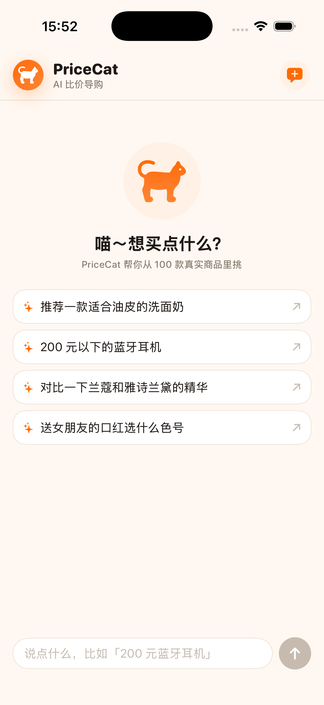
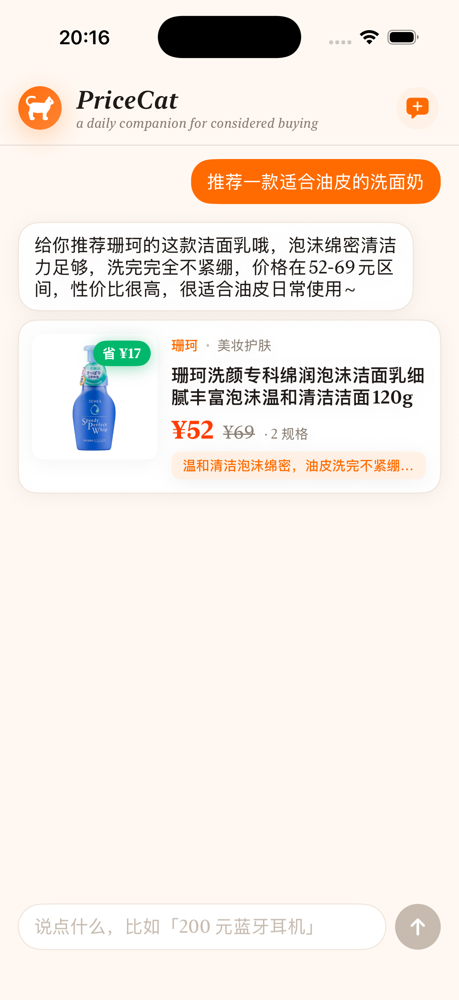
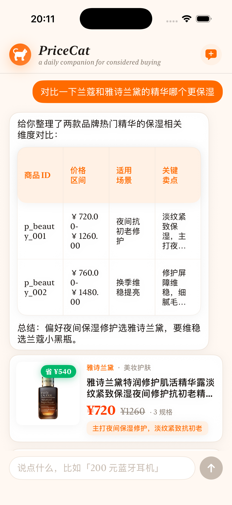

# 基于 RAG 的多模态电商智能导购 AI Agent

> 把传统“展示型电商广告”升级为“交互型 AI 导购”：iOS 原生 App + FastAPI 后端 +
> Doubao LLM + Milvus Lite 向量检索，端到端跑通文本 / 图片 / 语音多轮对话推荐。

完整设计请阅读 [`docs/01_项目开发文档.md`](docs/01_项目开发文档.md)；数据 / 后端 / iOS 三向细节分别在 `docs/02`、`docs/03`、`docs/04`。

---

## 仓库结构

```
.
├── docs/                       # 全部 Markdown 文档
├── server/                     # 后端（FastAPI + Python 3.11）
├── client/                     # iOS 客户端（Swift / SwiftUI）
├── docker/                     # 本地基础设施（MySQL 8）
└── ecommerce_agent_dataset/    # 课题给定的 100 条脱敏商品数据
```

---

## 一键启动（开发期 demo）

> 前置：macOS 已安装 Docker Desktop、Python 3.11、Xcode 15+。

### 1. 起本地 MySQL 8

```bash
cd docker/mysql
docker compose up -d
docker exec shopping_mysql mysqladmin ping -h 127.0.0.1 -u root -proot_pwd
```

### 2. 后端环境 + 建表

```bash
cd ./server
python3.11 -m venv .venv && source .venv/bin/activate
pip install -r requirements.txt
cp .env.example .env                              
python -m app.db.init_db                          
uvicorn app.main:app --reload --host 0.0.0.0 --port 8000
```

健康检查：

```bash
curl http://127.0.0.1:8000/healthz
# {"app":"ok","db":"ok","db_error":null}
```

### 3. iOS 客户端

```bash
cd ./client
# 用 Xcode 打开 ShoppingGuide.xcodeproj（Phase 0 暂未生成 Xcode 工程文件，
# 请按 client/README.md 在本机新建 SwiftUI 工程后把 ShoppingGuide/ 下源码加入）。
```

---

## 阶段进度

- [x] **Phase 0**：环境与脚手架
- [x] **Phase 1**：数据工程与向量索引 ([详情](#phase-1-数据工程与向量索引)，[评测报告](docs/phase1_eval_report.md))
- [x] **Phase 2**：后端最小闭环 ([详情](#phase-2-后端最小闭环))
- [x] **Phase 3**：iOS 客户端最小闭环 ([详情](#phase-3-ios-客户端最小闭环))
- [ ] **Phase 4**：对话能力增强（多轮 / 反选 / 对比） — 进行中
  - [x] 子项 1：Query Rewriter + 结构化筛选 + 反选与排除 ([详情](#phase-4-1-query-rewriter--反选与排除)，[评测报告](docs/phase4_eval_report.md))
  - [x] 子项 2：多商品对比（CompareTargetExtractor + 并行检索 + GFM 表格 Prompt）([详情](#phase-4-2-多商品对比))
  - [ ] 子项 3：主动澄清（信息不足触发 chips）
  - [ ] 子项 4：多轮 memory 摘要压缩
- [ ] Phase 5：加分项（业务闭环 / 多模态 / 性能）
- [ ] Phase 6：打磨与交付

---

## Phase 1 数据工程与向量索引

100 件商品 → 1092 条文本 chunk → 2048 维向量索引 → 25 条评测 query **Top-5 召回 100%**。

按设计文档 [`docs/02_数据工程与RAG设计.md`](docs/02_数据工程与RAG设计.md) 落地，三步走：

### (a) Chunker + MySQL 主表灌库

| 文件 | 实现 |
| --- | --- |
| [`server/app/rag/chunker.py`](server/app/rag/chunker.py) | 单商品 JSON → 按 `title / description / faq / review` 四种语义字段切 chunk（不做固定 token 切分，避免 FAQ 被切碎）；每条 chunk 带 `product_id / chunk_type / category / brand / base_price / min_sku_price / max_sku_price / rating / source_id` metadata，价格字段强制 float 便于后续 Milvus 范围过滤 |
| [`server/tests/test_chunker.py`](server/tests/test_chunker.py) | 10 个单测：chunk 类型完整 / 计数与原 JSON 对齐 / source_id 唯一 / review rating 透传 / 全数据集产出落在 [800, 1200] 区间 / 空 rag_knowledge 兜底 |
| [`server/scripts/seed_mysql.py`](server/scripts/seed_mysql.py) | 遍历 `ecommerce_agent_dataset/*/data/*.json`，按 `product_id` 主键 upsert 写入 `products` + `skus` 表；幂等（重复跑数量不变），支持 `--truncate` 强制重灌、`--dataset` 自定义路径 |

**产出实测：**

```
chunker：100 件商品 → 1092 条 chunk
  └─ title=100  description=100  faq=439  review=453
seed_mysql：products=100，skus=585，按品类均分 (美妆/数码/服饰/食品 × 25 件)
chunker 单测：10/10 全过
```

### (b) Embedder + Milvus Lite 向量索引

| 文件 | 实现 |
| --- | --- |
| [`server/app/rag/embedder.py`](server/app/rag/embedder.py) | Doubao Embedding 封装：走 `client.multimodal_embeddings.create()`（控制台已下线纯文本 Embedding，统一改用多模态模型，文本走 `{"type":"text","text":...}` 单输入返回单向量）；ThreadPoolExecutor 8 路并发凑吞吐；tenacity 指数退避重试 429 / 5xx / 超时；写入前强制 L2 归一化；首调用懒探测 dim |
| [`server/app/rag/milvus_store.py`](server/app/rag/milvus_store.py) | `products_text` collection 封装：13 字段 schema（含 metadata 全量）、FLAT 索引 + IP metric（1000 条规模 FLAT 暴搜即可，省去 IVF 训练）；`ensure_collection(rebuild=False)` 幂等建库、`insert_chunks / search / count` 三个最小操作面 |
| [`server/scripts/build_index.py`](server/scripts/build_index.py) | 串起 chunker + embedder + milvus_store 的端到端入口：支持 `--rebuild` 重建、`--limit N` 联调用前 N 件、`--dry-run` 只跑 chunker 不调 API；跑完自动做一次 sanity Top-3 抽查 |
| [`server/app/config.py`](server/app/config.py) | 新增 `ARK_EMBEDDING_API_KEY`（可选，缺省回退到 `ARK_API_KEY`），用于 LLM 与 Embedding 分账户的场景（主办方 key 调不了你自己账号下的 Embedding 端点） |

**产出实测（1092 条全量）：**

```
Embedding：17.4s （8 路并发）
写入 Milvus：1092 条，dim=2048
Sanity search Top-3（用 p_beauty_001 自身向量当 query）:
  1.0000  p_beauty_001  title
  0.8877  p_beauty_001  description
  0.7261  p_beauty_002  title    (兰蔻精华，同类目相邻品牌)
```

**期间踩到的依赖坑（已在 `requirements.txt` 修改配套版本）：**

1. `pymilvus 2.4.9` 依赖 `pkg_resources`（setuptools 81 起被移除）→ 升 `pymilvus==2.5.18`
2. `milvus-lite 3.0` 的 search 服务端 bug（`AttributeError: function_score`）→ 降回 `milvus-lite==2.5.1`
3. 而 `milvus-lite 2.5.1` 又依赖 `pkg_resources` → 钉 `setuptools<81`（临时方案，milvus-lite 迁移 importlib.metadata 后可摘）
4. 控制台已下线纯文本 Embedding 模型，只剩 `doubao-embedding-vision-*` 多模态系列 → Embedder 改用 `multimodal_embeddings.create()` 接口

### (c) Top-K Recall 评测

| 文件 | 实现                                                                                                                           |
| --- |------------------------------------------------------------------------------------------------------------------------------|
| [`server/scripts/eval/queries.json`](server/scripts/eval/queries.json) | 25 条手工黄金集，覆盖四种意图：`category_recommend` × 8 / `price_filter` × 5 / `brand_exclude` × 4 / `scenario` × 8；每条标 1-3 个示例 product_id |
| [`server/scripts/eval_recall.py`](server/scripts/eval_recall.py) | 黄金集逐条 embed → search Top-50 chunk → 按 product_id 去重 → 计算 Top-1/3/5/10 Recall；按意图分组统计；可选 `--output` 输出 Markdown 报告            |

**评测结果：**

| 指标 | Top-1 | Top-3 | Top-5 | Top-10 |
| --- | --- | --- | --- | --- |
| **总体 Recall** | **80.00%** (20/25) | **100%** (25/25) | **100%** (25/25) | **100%** (25/25) |

| 意图 | n | Top-1 | Top-3 | Top-5 |
| --- | --- | --- | --- | --- |
| category_recommend | 8 | 87.5% | 100% | 100% |
| price_filter | 5 | 100% | 100% | 100% |
| scenario | 8 | 100% | 100% | 100% |
| brand_exclude | 4 | **0%** | 100% | 100% |

- **Top-5 100% 达 [docs/02 §9.2](docs/02_数据工程与RAG设计.md#92-指标) 目标（≥ 80%）**
- `brand_exclude` Top-1=0% 印证了 docs/02 §5.4 的设计预判——"向量模型不擅长否定语义"，这块要靠 Phase 2 的 Query Rewriter 把"非 X 品牌"解析成 metadata 过滤，不是 Phase 1 向量召回能解决的
- 全量耗时 3.5s（25 次 embed + 25 次 search）

完整 query-级别明细见 [`docs/phase1_eval_report.md`](docs/phase1_eval_report.md)。

### Phase 1 复跑指令

```bash
cd server
source .venv/bin/activate

# 1. (a) MySQL 主表
python -m app.db.init_db        # 建表（已存在跳过）
python -m scripts.seed_mysql    # 灌 100 件商品

# 2. (b) 向量索引
python -m scripts.build_index --rebuild   # 全量 ~20s

# 3. (c) 评测
python -m scripts.eval_recall --output ../docs/phase1_eval_report.md
```

---

## Phase 2 后端最小闭环

FastAPI + SSE + Agent 编排，把 Phase 1 的向量索引串成可被 iOS 调用的实时对话接口。完整流程：

```
iOS  ── POST /api/v1/chat/stream ──▶  IntentRouter
                                       └─▶ RagRetriever (embed → Milvus → 聚合 Top-N)
                                              └─▶ PromptBuilder (RECOMMEND / COMPARE)
                                                     └─▶ Doubao LLM stream
                                                            └─▶ ProductCardExtractor
                                                                   └─▶ MySQL hydrate
                                                                          └─▶ SSE events
```

### (a) Agent 层

| 文件 | 实现 |
| --- | --- |
| [`server/app/agent/intent.py`](server/app/agent/intent.py) | 规则版 IntentRouter：关键词区分 recommend / compare / cart_op / clarify_needed，省一次 LLM 调用降低首 token 延迟；Phase 4 再 fallback LLM JSON 抽取 |
| [`server/app/agent/prompts.py`](server/app/agent/prompts.py) | 集中管理 RECOMMEND / COMPARE 两套 Prompt；硬约束 `product_id` 仅从 `<retrieved_products>` 取、找不到必须明说"抱歉未找到"、卡片协议用 ```product_cards 围栏 JSON 输出 |
| [`server/app/agent/card_extractor.py`](server/app/agent/card_extractor.py) | 流式 token 解析器：识别 ```product_cards 围栏、跨 token 切分容错、JSON 解析、`allowed_ids` 过滤幻觉 product_id、reason 字段 ≤120 字符截断；围栏未闭合时整段丢弃绝不当正文吐 |
| [`server/app/agent/memory.py`](server/app/agent/memory.py) | 进程内会话记忆：session_id 缺失生成 UUID，最近 6 轮 FIFO 截断，记录 `last_recommended_ids` 给 Phase 4 指代消解用 |
| [`server/app/agent/orchestrator.py`](server/app/agent/orchestrator.py) | 主流程编排：emit session → 意图分发 → 检索 → Prompt → LLM 流式 → 卡片提取 → MySQL hydrate → emit done；LLM 异常降级到推 Top-3 检索结果作为兜底卡片 |

### (b) LLM / 检索封装

| 文件 | 实现 |
| --- | --- |
| [`server/app/llm/doubao_client.py`](server/app/llm/doubao_client.py) | `AsyncArk.chat.completions.create(stream=True)` 封装：`chat_stream(messages) → AsyncIterator[str]`，跳过空 delta / 心跳 chunk |
| [`server/app/rag/retriever.py`](server/app/rag/retriever.py) | Phase 1 embedder + milvus_store 之上的聚合层：query → Top-K chunk → 按 product_id 去重保留最高分 → 返回 `RetrievedProduct` 列表 |
| [`server/app/db/product_repo.py`](server/app/db/product_repo.py) | SSE 卡片 hydrate 用：`get_card_view(product_id)` 查 MySQL Products+SKUs，拼出标题 / 品牌 / image_url / price_range / SKU 列表；LLM 不允许参与任何字段填充 |

### (c) API 层

| 文件 | 实现 |
| --- | --- |
| [`server/app/api/chat.py`](server/app/api/chat.py) | `POST /api/v1/chat/stream`：sse-starlette EventSourceResponse + ping=15s 心跳；按 docs/03 §3.2 契约 emit session / status / token / product_card / clarify / error / done 七类事件 |
| [`server/app/api/products.py`](server/app/api/products.py) | `GET /api/v1/products/{id}`：详情页用，返回完整 SKU + image_url + 原 JSON |
| [`server/app/api/deps.py`](server/app/api/deps.py) | FastAPI 依赖注入工厂：retriever / llm / product_repo / orchestrator 全部走 `lru_cache` 单例；测试期可用 `app.dependency_overrides` 替换 fake |
| [`server/app/schemas/`](server/app/schemas/) | `ChatRequest` + 7 类 SSE 事件 Pydantic 模型，与 iOS `JSONDecoder.keyDecodingStrategy = .convertFromSnakeCase` 对齐 |

### (d) 防幻觉 5 层保险（docs/02 §7 落地）

1. **Prompt 硬约束**：System Prompt 明确 `product_id` 只能从 `<retrieved_products>` 取；
2. **流式抽取过滤**：`ProductCardExtractor` 用 `allowed_ids` 拦截 LLM 编造的 ID；
3. **MySQL hydrate**：卡片的标题 / 价格 / SKU 名 全部走 `ProductRepository.get_card_view` 取真实数据，LLM 只提供 `reason` 文案；
4. **缺仓库丢卡片**：MySQL 查不到 product_id 直接 drop 卡片，不会作为兜底显示；
5. **LLM 异常兜底**：超时 / 限流时不让用户看到空白，emit error 后推检索 Top-3 真实商品。

### (e) 测试覆盖

```
tests/
├── test_card_extractor.py    9 用例（围栏跨 token 切分、未闭合丢弃、reason 截断、unknown id 过滤等）
├── test_intent.py           11 用例（recommend / compare / cart_op / clarify 边界）
├── test_doubao_client.py     3 用例（顺序 yield、空 delta、心跳 chunk 容错）
├── test_retriever.py         5 用例（按 product_id 聚合、保留最高分、空检索）
├── test_prompts.py           5 用例（防幻觉关键词在 system、检索块嵌入、history 透传）
├── test_memory.py            5 用例（UUID 生成、复用、6 轮窗口截断）
├── test_orchestrator.py      6 用例（happy path、clarify 短路、cart_op 占位、LLM 异常兜底、幻觉 id 拦截）
└── test_api_chat.py          1 用例（FastAPI TestClient + dependency_overrides 走完 SSE）
```

合计 **45 条新增单测 / 集成测，全部绿**（55 总，连同 Phase 1 chunker 10 条）。

### Phase 2 验收实测

启动服务后跑：

```bash
cd server && bash scripts/smoke_chat.sh
# 也可显式：bash scripts/smoke_chat.sh "200 元以下的蓝牙耳机"
```

实测输出（节选 query=`推荐一款适合油皮的洗面奶`）：

```
event: session
data: {"session_id": "c17498d951494e4c9944d44b8e1a7222"}

event: status   data: {"stage":"parsing"}
event: status   data: {"stage":"retrieving"}
event: status   data: {"stage":"generating"}

event: token    data: {"text":"给"}
event: token    data: {"text":"你"}
...
event: token    data: {"text":"性价比"}
event: token    data: {"text":"很高"}
event: token    data: {"text":"。"}

event: product_card
data: {
  "product_id": "p_beauty_011",
  "title": "珊珂洗颜专科绵润泡沫洁面乳…120g",
  "brand": "珊珂",
  "image_url": "http://127.0.0.1:8000/static/1_美妆护肤/images/p_beauty_011_live.jpg",
  "price_range": {"min": 52.0, "max": 69.0},
  "skus": [
    {"sku_id":"s_p_beauty_011_1","properties":{"规格":"120g 标准装"},"price":52.0},
    {"sku_id":"s_p_beauty_011_2","properties":{"规格":"150ml 起泡泵装"},"price":69.0}
  ],
  "reason": "泡沫绵密清洁力强，洗完不紧绷，适配油皮"
}

event: done     data: {"finish_reason":"stop"}
```

`p_beauty_011` 真实存在于 MySQL 与 Milvus，价格 / SKU 取自数据库快照，LLM 仅生成 reason 文案——满足 docs/01 §6.1 防幻觉约束。

### Phase 2 复跑指令

```bash
cd server
source .venv/bin/activate

# 1. 依赖前置（如未跑过 Phase 1 数据准备）
python -m app.db.init_db
python -m scripts.seed_mysql
python -m scripts.build_index --rebuild

# 2. 跑单测套件（不需要 API Key，全离线）
python -m pytest tests/ --ignore=tests/test_smoke.py

# 3. 启动 FastAPI（另开窗口跑 smoke）
uvicorn app.main:app --reload --host 0.0.0.0 --port 8000

# 4. SSE 端到端
bash scripts/smoke_chat.sh                                   # 默认 query
bash scripts/smoke_chat.sh "200 元以下的蓝牙耳机有哪些？"      # 自定义

# 5. 商品详情
curl -s http://127.0.0.1:8000/api/v1/products/p_beauty_011 | python3 -m json.tool
```

---

## Phase 3 iOS 客户端最小闭环

SwiftUI + URLSession 自实现 SSE 长连接，端到端跑通"输入 → 流式回复 → 商品卡片 → 详情页"，并在最小闭环之上完成一轮品牌化重做：**PriceCat**（致敬 Coupert）品牌身份 + New York 衢线 editorial 字体 + 极简 Markdown 表格渲染，告别"AI 模板感"。

<p align="center">
  
  
  
</p>

### (a) 视觉系统：PriceCat 品牌化

| 文件 | 实现 |
| --- | --- |
| [`client/ShoppingGuide/Resources/Theme.swift`](client/ShoppingGuide/Resources/Theme.swift) | 集中管理品牌色 / 字体 / 圆角 / 阴影 token，禁止视图层硬编码：品牌橙 `#FF6B00` / 浅橙白底 `#FFF8F2` / 价格红 `#FF3D00` / 省钱绿 `#00B86B` / chip 浅橙 `#FFF1E5`；全局走 `.system(design: .serif)` → iOS 系统映射到 **New York**（Apple 自家衬线，质感对标 Claude.ai 用的 Tiempos Text），主动远离常见 AI 应用的 sans-serif "AI slop"；导出 `display / title / body / caption / priceLg / priceMd / brandWordmark / tableHeader / tableCell` 字体 token；圆角 `chip 8 / card 16 / hero 20 / bubble 18 / pill 999`；阴影 `card / lifted` |
| [`client/ShoppingGuide.xcodeproj/project.pbxproj`](client/ShoppingGuide.xcodeproj/project.pbxproj) | `INFOPLIST_KEY_CFBundleDisplayName = PriceCat`，主屏图标下显示品牌名 |

### (b) 模块分层

| 文件 | 实现 |
| --- | --- |
| [`client/ShoppingGuide/Models/`](client/ShoppingGuide/Models/) | `ChatMessage` / `ProductCard` / `SSEEvent` enum / `ClarifyPayload`；与后端 `app/schemas/chat.py` 字段对齐，统一走 `JSONDecoder.keyDecodingStrategy = .convertFromSnakeCase` |
| [`client/ShoppingGuide/Networking/SSEParser.swift`](client/ShoppingGuide/Networking/SSEParser.swift) | 按 W3C SSE spec 解析 `event:` / `data:` 行 → `SSEEvent`；归一化 `\r\n` / `\r` 换行（关键坑：Swift 把 `\r\n` 当成一个 grapheme cluster，直接 split 拆不开） |
| [`client/ShoppingGuide/Networking/StreamingClient.swift`](client/ShoppingGuide/Networking/StreamingClient.swift) | `URLSession + URLSessionDataDelegate` 自实现 SSE 长连接；缓冲区同时识别 `\r\n\r\n` / `\n\n` 帧分隔；解析到 `done` 主动 finish，否则等 `didCompleteWithError`；`onTermination` 强引用 self 防止 transport 创建后立即释放 |
| [`client/ShoppingGuide/Networking/APIClient.swift`](client/ShoppingGuide/Networking/APIClient.swift) | `buildChatStreamRequest`（POST + `Accept: text/event-stream`）+ `fetchProductDetail` GET 异步；`ProductDetail` Codable 模型 |
| [`client/ShoppingGuide/Features/Chat/ChatTransport.swift`](client/ShoppingGuide/Features/Chat/ChatTransport.swift) | `ChatTransport` protocol 把 ViewModel 与具体 SSE 实现解耦；`LiveChatTransport` 走真实 APIClient，`FakeChatTransport` 给测试喂事件数组 |
| [`client/ShoppingGuide/Features/Chat/ChatViewModel.swift`](client/ShoppingGuide/Features/Chat/ChatViewModel.swift) | `@MainActor ObservableObject`：token → 累加 `text`、productCard → 追加 `productCards`、clarify → 写入 `clarify`、error → 挂 `errorNotice`、done → `isStreaming = false`；session_id 多轮复用 |
| [`client/ShoppingGuide/Features/Chat/ChatView.swift`](client/ShoppingGuide/Features/Chat/ChatView.swift) | 主页：自绘品牌头（渐变橙猫脸 + `PriceCat` italic wordmark + "a daily companion for considered buying" 副标）+ 空状态居中猫咪图标 + 4 条 starter chips + 输入栏改 pill 圆角橙色 CTA（focus 时品牌色描边）+ ScrollViewReader 流式自动滚底；DEBUG 编译时 `-autoSendDemo "<query>"` launch arg 自动发一条 smoke；用 `static autoSendDemoFired` flag 守一次性（`@State` 随 view 重建归零，从 ProductDetailView pop 回来会重复触发） |
| [`client/ShoppingGuide/Features/Chat/MessageBubble.swift`](client/ShoppingGuide/Features/Chat/MessageBubble.swift) | 旧实现给 `Text` 加 `.frame(maxWidth: .infinity)` 把气泡撑成整行宽 → 改 `HStack { Spacer / Bubble }` 让气泡 hug 文字真实尺寸；用户气泡品牌橙底白字、Assistant 白底浅边框；流式光标从字符 `▍` 改成呼吸圆点（不再让气泡尺寸抖动）；**Assistant 消息按 markdown block 拆分**——连续段落塞同一气泡、表格独占消息列全宽（突破气泡 `Spacer(minLength:)` 限宽，避免中文每字一行竖排）；用户气泡用纯 `Text`、Assistant 走 `MarkdownView` 支持表格；展示前 `trimmingCharacters(.whitespacesAndNewlines)` 作为后端 rstrip 的展示层 fallback |
| [`client/ShoppingGuide/Components/MarkdownParser.swift`](client/ShoppingGuide/Components/MarkdownParser.swift) | 极简块级 Markdown 解析（200 行）：行级扫描状态机切「段落 / GFM 表格」两类 block；严格模式认 `\| --- \| --- \|` 分隔行，宽松模式允许 LLM 忘写分隔行（≥2 行同列管道行即当表格）；防御性 fallback：单行管道仍按段落处理；行内 `**bold**` / `*italic*` 交给系统 `AttributedString(markdown:)`；不支持也不打算支持标题 / 列表 / 代码块（Prompt 已硬约束 LLM 不输出） |
| [`client/ShoppingGuide/Components/MarkdownView.swift`](client/ShoppingGuide/Components/MarkdownView.swift) | 把 `MarkdownBlock` 渲染成 SwiftUI 视图：段落 = `Text(AttributedString)` 衢线 body；`TableBlockView` = 表头浅橙底 + 品牌色衢线 + hairline 列&行分隔（**禁止"程序员风"完整 grid**）+ 卡片圆角描边；`TableBlockView` 可见性 `internal` 让 `MessageBubble` 直接复用（长表格突破气泡限宽独立放置） |
| [`client/ShoppingGuide/Features/Product/ProductCardView.swift`](client/ShoppingGuide/Features/Product/ProductCardView.swift) | Coupert 风布局：左 110×110 主图 + 右上角"省 ¥xx"绿色 saved badge（`max-min` 差）+ 现价大红字 / 原价划线灰 + reason 浅橙 chip + SKU 数小角标；整张卡片包 `NavigationLink` push 详情 |
| [`client/ShoppingGuide/Features/Product/ProductDetailView.swift`](client/ShoppingGuide/Features/Product/ProductDetailView.swift) | hero 图 4:3 + 大字衢线标题 + 起价 28pt 重字 + SKU 列表统一白底卡片；进入 `task` 调 `GET /api/v1/products/{id}` |

### (c) 服务端配套修复：ProductCardExtractor 根治尾部空白泄漏

LLM 正文通常以 `\n\n` 收尾再接 ```` ```product_cards ```` 围栏，旧版 [`server/app/agent/card_extractor.py`](server/app/agent/card_extractor.py) 在 NORMAL 状态下没找到 fence 就把尾部空白立即 emit，导致 iOS 气泡末尾出现 2 行空白（撑高一块灰格子）：

- NORMAL 状态尾部连续空白与可能的 fence 前缀一起 hold，等下一个非空 token 或真 fence 来再决定；
- fence open 命中时 `buffer[:open_idx].rstrip()` 再 emit；
- `finalize` 残留 buffer 也 `rstrip()` 丢掉文末空白。

新增 4 条 TDD 用例覆盖：fence 前 `\n\n` / 段内换行保留 / 纯文本 finalize trim / 流式 token 切割。客户端 `MessageBubble` 的 `trim` 保留作为展示层 fallback——后端协议干净，客户端再加一层防御。

### (d) 测试覆盖

[`client/Package.swift`](client/Package.swift) 是独立 SwiftPM 包，与 Xcode 工程**共用** `ShoppingGuide/` 下源文件（不复制不分叉），用 `swift test` 在 macOS 上跑客户端逻辑层单测。

```
client/Tests/ShoppingGuideKitTests/
├── SSEParserTests.swift         12 用例（token/session/status/product_card/clarify/error/done、CRLF 帧、心跳注释、坏 JSON、未知事件、event/data 任意顺序）
├── ChatViewModelTests.swift      6 用例（happy path 累加 token + 卡片、clarify、error 不中断、空输入忽略、status 不污染正文、session_id 跨轮保留）
└── MarkdownParserTests.swift    11 用例（单段 / 空行多段 / GFM 表 / 段+表+总结 / 对齐符号 / 缺分隔行宽松匹配 / 单 \n 段表混排 / 单管道行不误判 / 流式半行不崩 / 行内 bold+italic / 空输入）
```

客户端合计 **29 用例全部绿**；后端 [`server/tests/test_card_extractor.py`](server/tests/test_card_extractor.py) 同步增至 13 用例，全套服务端 59 用例全过。命令行：

```bash
cd client
DEVELOPER_DIR=/Applications/Xcode.app/Contents/Developer swift test
```

### (e) Phase 3 验收实测（iPhone 17 模拟器）

**场景 1 · 推荐**：`-autoSendDemo "推荐一款适合油皮的洗面奶"`

1. 用户气泡：`推荐一款适合油皮的洗面奶`（品牌橙底）
2. Assistant 气泡逐字流出，衢线 New York 字体，末尾呼吸圆点
3. 文字下方插入 PriceCat 风卡片：`p_beauty_011`（珊珂洗颜专科绵润泡沫洁面乳 120g），左 110×110 主图 + 右上"省 ¥17"绿 badge + 现价 ¥52 大红字 + reason 浅橙 chip
4. 主图通过 `/static/1_美妆护肤/images/p_beauty_011_live.jpg` 异步加载
5. 点击卡片 push `ProductDetailView`，hero 图 + 全部 SKU 白底卡片列表

**场景 2 · 对比**：`-autoSendDemo "对比一下兰蔻小黑瓶和雅诗兰黛小棕瓶"`

1. Assistant 引导段：「我整理了两款精华的对比：」
2. **下方独占消息列全宽的 Markdown 表格**：表头浅橙底品牌色衢线，4 列「商品ID / 价格区间 / 保湿核心表现 / 适用肤质」hairline 分隔，全程横向布局不再竖排
3. 表格后跟总结段 + 2 张商品卡片

`p_beauty_011` 等所有 product_id 均真实存在于 MySQL；卡片的标题 / 品牌 / 价格 / 图片 URL 全部由 [`app/db/product_repo.py`](server/app/db/product_repo.py) 从 MySQL hydrate，LLM 仅生成 `reason` 与对比表格的文案描述——满足课题"严禁幻觉"硬约束。

### Phase 3 复跑指令

前置：Xcode 16+（用 `PBXFileSystemSynchronizedRootGroup` 自动同步 `ShoppingGuide/` 整目录）。详细 Xcode 工程初始化步骤见 [`client/README.md`](client/README.md)。

```bash
# 1. 后端先起来
cd server && source .venv/bin/activate
uvicorn app.main:app --host 127.0.0.1 --port 8000 &

# 2. 客户端单测（macOS 上离线跑，~1s）
cd ../client
DEVELOPER_DIR=/Applications/Xcode.app/Contents/Developer swift test

# 3. iOS 模拟器手动跑：Xcode 打开 client/ShoppingGuide.xcodeproj，选 iPhone 17 模拟器 → Cmd+R

# 4. 命令行 e2e smoke（一键起 sim + 自动发一条验收 query）
DEV=/Applications/Xcode.app/Contents/Developer
UDID=$($DEV/usr/bin/xcrun simctl list devices available | grep "iPhone 17 " | head -1 | grep -oE "[0-9A-F-]{36}")
DEVELOPER_DIR=$DEV xcrun simctl boot "$UDID" 2>/dev/null
DEVELOPER_DIR=$DEV xcodebuild -project client/ShoppingGuide.xcodeproj -scheme ShoppingGuide \
  -destination "platform=iOS Simulator,name=iPhone 17" -configuration Debug build
APP=$(find ~/Library/Developer/Xcode/DerivedData -name ShoppingGuide.app -path "*Debug-iphonesimulator*" | head -1)
DEVELOPER_DIR=$DEV xcrun simctl install "$UDID" "$APP"
DEVELOPER_DIR=$DEV xcrun simctl launch "$UDID" com.yute.ShoppingGuide \
  -autoSendDemo "推荐一款适合油皮的洗面奶"
DEVELOPER_DIR=$DEV xcrun simctl io "$UDID" screenshot /tmp/phase3.png
open /tmp/phase3.png
```

---

## Phase 4-1 Query Rewriter + 反选与排除

把"用户自然语言查询"拆成「干净的语义 query + 结构化 filter 表达式」喂回向量召回链路，根治 Phase 1 评测报告里点名的 `brand_exclude Top-1=0%` 漏洞。

### (a) 模块分层

| 文件 | 实现 |
| --- | --- |
| [`server/app/agent/query_rewriter.py`](server/app/agent/query_rewriter.py) | `QueryRewriter` 双路径：**规则正则优先**（`X 元以下` / `预算 X` / `不要 X 品牌` / `非 X` / `100-200 元` 等 pattern，靠 `_RE_PRICE_MAX` / `_RE_PRICE_MIN` / `_RE_PRICE_RANGE` / `_RE_BRAND_EXCLUDE` 4 条 regex 配合 brand 白名单匹配兜底）+ **LLM JSON 兜底**（命中"国产 / 日系 / 韩系 / 欧美 / 国货 / 进口"等需要语义推断的地域词才调一次 Doubao 抽取，否则不调省首 token 延迟）；输出 `ParsedQuery(search_query, price_min/max, categories, brands_include/exclude)`，`to_filter_expr()` 拼成 Milvus `min_sku_price <= X and brand not in [...]` 表达式 |
| [`server/app/agent/query_rewriter.py`](server/app/agent/query_rewriter.py)（`_split_brand_aliases`） | 库内品牌「Apple 苹果」复合写法 → 拆 alias `{Apple, 苹果}` 全部映射回 canonical，让用户写单边都能命中；`_match_brand` 前缀逐字回退（"耐克的跑鞋" → "耐克的跑" → "耐克 ✓"）容忍 regex 贪婪匹配 |
| [`server/app/llm/doubao_client.py`](server/app/llm/doubao_client.py) | 新增 `chat_json(messages)` 非流式接口；当前 Doubao 模型还不支持 `response_format=json_object` 强模式（直接 400），改走「Prompt 硬约束 + 容错解析」：`_extract_json_object` 依次尝试 `json.loads` → 去 ```` ```json ``` ```` 围栏 → 花括号配对扫描定位第一个完整 JSON object，三种失败才抛 `ValueError` 走规则兜底 |
| [`server/app/rag/retriever.py`](server/app/rag/retriever.py) | `RagRetriever.search(query, filter_expr=...)` 把 expr 透传给 Milvus `client.search(filter=...)`，FLAT + IP metric 下 scalar 过滤在 1k 数据规模上 latency 几乎免费 |
| [`server/app/agent/orchestrator.py`](server/app/agent/orchestrator.py) | retrieve 前调 `query_rewriter.parse()` → 用 rewritten `search_query` 做 embedding、把 `filter_expr` 传给 retriever；**filter 过严吃光命中时去掉 filter 兜底再来一次**（与 eval_recall 一致策略，避免"啥也搜不到"的死路）；`query_rewriter=None` 时退化成 identity rewriter，Phase 2 旧测试 0 改动通过 |
| [`server/app/db/product_repo.py`](server/app/db/product_repo.py) | `list_brands()` 拉品牌全集，启动时灌进 rewriter 做 LLM 白名单（LLM 编造的"FakeBrandX" 在 `_merge` 阶段被丢弃，5 层防幻觉再多一层） |
| [`server/app/main.py`](server/app/main.py) | lifespan 启动时一次性 `await repo.list_brands()` → `rewriter.set_known_brands()`，加载失败也不挡服务起来（rewriter 自动回退到无 brand 白名单的规则裸跑） |

### (b) 库内类目 / 品牌实际值踩坑

类目字段在 MySQL 实际是 `美妆护肤 / 数码电子 / 服饰运动 / 食品饮料`（不是数据集目录名"服饰穿戴"），品牌字段对 Apple 用 `Apple 苹果` 复合写法。eval 第一次跑出 `category in ["服饰穿戴"]` 命中 0 条揭露了这个偏差。`KNOWN_CATEGORIES` 与 `_CATEGORY_ALIASES` 已对齐 MySQL 真实值，品牌 alias 拆分支持 `Apple 苹果` 单写命中。

### (c) 测试覆盖

```
server/tests/
├── test_query_rewriter.py     20 用例
│   ├── to_filter_expr × 5     （空 / 价格 / 范围 / 类目+排除 / 双引号转义）
│   ├── 规则路径 × 8           （X 元以下/预算 X/范围/不要 X/非 X/类目别名/白名单外不误匹配/剥词不丢语义）
│   ├── LLM 兜底 × 4           （地域词触发 / 普通 query 不触发 / LLM 异常回退 / 编造品牌被丢弃）
│   ├── 复合品牌名 × 1         （Apple 苹果 单写 Apple 或 苹果 都命中）
│   ├── 空输入 × 1
│   └── 剥词保留语义 × 1
└── 全套 79 用例（原 59 + 新 20）全过
```

### (d) Phase 4-1 评测实测（25 条黄金集，对照 Phase 1 baseline）

| 意图 | n | Phase 1 Top-1 | **Phase 4 Top-1** | Top-5 |
| --- | --- | --- | --- | --- |
| **总体** | 25 | 80.00% | **92.00% (+12pp)** | 100% |
| brand_exclude | 4 | **0%** | **75% (+75pp)** | 100% |
| price_filter | 5 | 100% | 100% | 100% |
| category_recommend | 8 | 87.5% | 87.5% | 100% |
| scenario | 8 | 100% | 100% | 100% |

完整明细见 [`docs/phase4_eval_report.md`](docs/phase4_eval_report.md)。q16 "国产旗舰手机推荐" Top-1 命中 vivo（语义正确但不在原 gold——gold 只标了华为/小米/OPPO 三款，属 gold 标注限制；Top-5 已命中 gold）。

### (e) 端到端示例（rewriter → filter → milvus）

```python
>>> parsed = await rewriter.parse("不是耐克的专业跑鞋")
>>> parsed.search_query
'的专业跑鞋'
>>> parsed.brands_exclude
['耐克']
>>> parsed.to_filter_expr()
'category in ["服饰运动"] and brand not in ["耐克"]'

# LLM 兜底场景
>>> parsed = await rewriter.parse("国产旗舰手机推荐")
>>> parsed.brands_exclude  # LLM 自动列出 25 个非国产品牌
['AHC', 'Apple 苹果', 'HOKA', 'Nike', 'Osprey', 'SK-II',
 'The North Face', 'The Ordinary', '优衣库', '可口可乐', ...]
>>> parsed.to_filter_expr()
'category in ["数码电子"] and brand not in ["AHC", "Apple 苹果", "HOKA", "Nike", ...]'
```

### Phase 4-1 复跑指令

```bash
cd server
source .venv/bin/activate

# 1. 单测（19 条 rewriter + 6 条 orchestrator + 全套 79 条）
python -m pytest tests/ --ignore=tests/test_smoke.py

# 2. baseline 评测（Phase 1 行为，不带 rewriter）
python -m scripts.eval_recall

# 3. rewriter 规则版（离线可复现，不调 LLM）
python -m scripts.eval_recall --with-rewriter rules

# 4. rewriter LLM 版（需 ARK_API_KEY；q16 走 LLM 抽取）
python -m scripts.eval_recall --with-rewriter llm --output ../docs/phase4_eval_report.md
```

---

## Phase 4-2 多商品对比

补齐 Phase 2 `compare` 意图分支：用户问「对比 A 和 B 哪个更 X」时，从单句拆出 2-3 个独立检索 target 各自跑一遍 retrieve，合并去重后塞 prompt；LLM 按 GFM Markdown 表格输出对比维度，前端（phase3 已就位的 MarkdownView）直接渲染。

### (a) 模块分层

| 文件 | 实现 |
| --- | --- |
| [`server/app/agent/compare_planner.py`](server/app/agent/compare_planner.py) | `CompareTargetExtractor` 双路径：**规则 fast-path**（识别 `对比/比较/比一比/vs/VS` 触发词 → 砍尾部 `哪个更XXX/哪款更XXX/呢/吗` → 按 `和/与/跟/、` 切两段 → 公共修饰回灌：`兰蔻和雅诗兰黛的精华` 中"的精华"补给前段、尾部疑问关键词"保湿"补给所有段）+ **LLM JSON 兜底**（规则切不出 ≥2 段时调 `chat_json` 抽 `{"targets":[...]}`）；失败兜底返回 `[原文]` 让 orchestrator 退化整句检索 |
| [`server/app/agent/orchestrator.py`](server/app/agent/orchestrator.py) | `_compare_retrieve()`：每个 target 各 `retriever.search(top_n_products=2)`，按命中顺序去重；合并 <2 件时去掉 filter 兜底；仍不足整句兜底；最多 3 件塞 prompt 防止 LLM 表格爆宽 |
| [`server/app/agent/prompts.py`](server/app/agent/prompts.py) | `build_compare_messages` 加强：表头第一列固定 `对比维度`、其余列**必须填 retrieved_products 真实 product_id**、GFM 分隔行强约束、3-4 行维度（价格区间 / 关键卖点 / 适用场景）、表后空行写 ≤40 字总结句、最后照旧 product_cards 围栏 |
| [`server/app/api/deps.py`](server/app/api/deps.py) | `get_compare_extractor` 单例工厂；orchestrator 装配时注入，缺省 None 时 compare 分支退化整句检索（Phase 2 行为） |

### (b) 测试覆盖

```
server/tests/
├── test_compare_planner.py   10 用例
│   ├── 规则路径 × 7   (和/与/跟连接、vs、3 目标、无触发词不切、空输入、剥尾部疑问、公共修饰回灌)
│   └── LLM 兜底 × 3   (规则失败触发 / 规则够用不触发 / LLM 异常不挂)
└── test_orchestrator.py 新增 1 用例：compare 分支真的调 extractor + 对每个 target 各 retrieve 一次 + token 流含 markdown 表头
```

服务端测试 79 → **90 全过**（含 phase4-1 的 79 条）。

### (c) Phase 4-2 端到端实测

```bash
bash scripts/smoke_chat.sh "对比一下兰蔻和雅诗兰黛的精华哪个更保湿"
```

LLM 实际输出（节选 token 拼接后的可见正文）：

```markdown
| 对比维度 | p_beauty_002 | p_beauty_001 |
| --- | --- | --- |
| 价格区间 | ￥760.00 - ￥1480.00 | ￥720.00 - ￥1260.00 |
| 关键卖点 | 修护维稳细腻毛孔提亮 | 淡纹紧致保湿夜间修护 |
| 适用场景 | 换季敏感初抗老人群 | 夜间修护抗初老人群 |

p_beauty_001 雅诗兰黛小棕瓶主打保湿功效，更适配你的保湿需求，价格更低。
```

紧接着两张 `product_card` 事件：`p_beauty_002`（兰蔻小黑瓶）+ `p_beauty_001`（雅诗兰黛小棕瓶），价格 / 标题 / image_url / SKU 全部从 MySQL hydrate；iOS 端 `MarkdownView` 自动把表格独占消息列全宽渲染（phase3 已支持，无需改客户端）。

### (d) 与 Phase 3 前端的衔接

- `MarkdownParser` 严格 + 宽松模式都能识别这套表格（[`test paragraphAndTableSeparatedBySingleNewline`](client/Tests/ShoppingGuideKitTests/MarkdownParserTests.swift) 覆盖）；
- `MessageBubble` 按 markdown block 拆分时表格独占全宽、段落进气泡（[`test parsesTableSurroundedByParagraphs`](client/Tests/ShoppingGuideKitTests/MarkdownParserTests.swift) 覆盖）；
- 不需要客户端任何改动，phase3 的衢线 editorial 视觉直接接住 phase4-2 的对比表格场景。

### Phase 4-2 复跑指令

```bash
cd server && source .venv/bin/activate

# 1. 单测
python -m pytest tests/test_compare_planner.py tests/test_orchestrator.py -v

# 2. 端到端 SSE
uvicorn app.main:app --host 127.0.0.1 --port 8000 &
bash scripts/smoke_chat.sh "对比一下兰蔻和雅诗兰黛的精华哪个更保湿"
bash scripts/smoke_chat.sh "iPhone 17 vs 华为 Pura 90"
```

---

## 强制规范

- 客户端必须 **iOS 原生**（Swift / SwiftUI），禁用 Web / H5 套壳。
- 依赖必须显式锁版本：`server/requirements.txt`、`client/.../Package.swift`。
- `.env` 严禁提交 Git；`API Key` 统一通过 `.env` 注入。
- **严禁幻觉**：Agent 不得编造库内不存在的商品 / 价格 / SKU；所有商品卡片字段必须来自检索结果。
